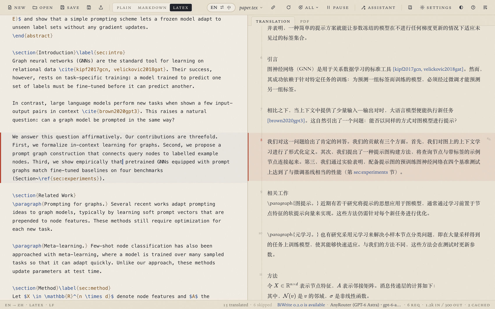
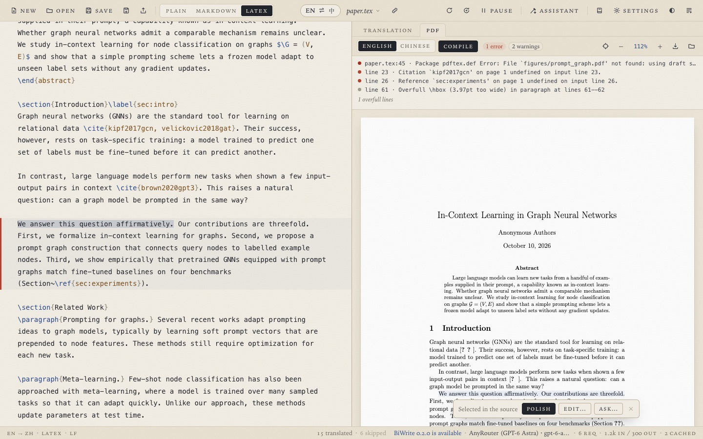
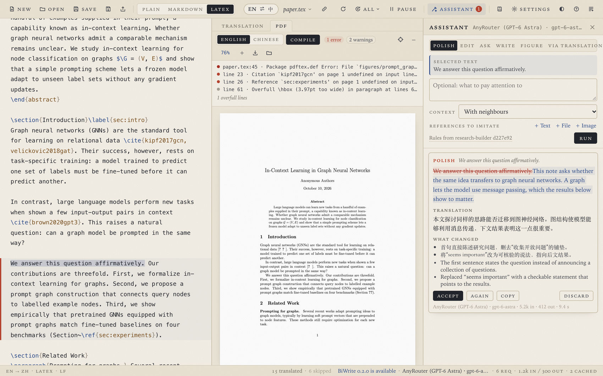
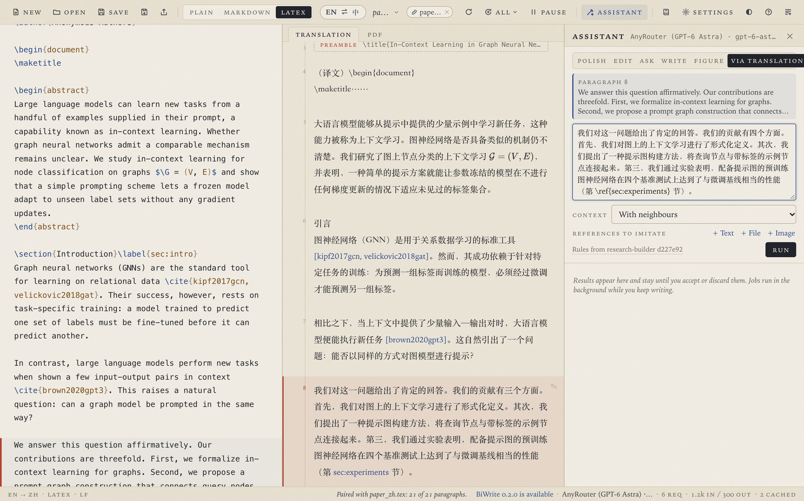

**English** | [简体中文](README.zh-CN.md)

# BiWrite

A desktop editor for writing an academic paper in English and Chinese at
once. You write on the left (LaTeX, Markdown or plain text). The right pane
shows the other language, one block per paragraph, and only the paragraphs
you change are translated again. A LaTeX paper compiles into a PDF beside
the source, a click on a sentence in the PDF selects it in the source, and a
writing assistant polishes, edits, answers questions, writes new paragraphs in
the manner of a published paper and writes figures, with the rules of the
[research-builder](https://github.com/qzkinhit/research-builder) skill. The
interface is in English or Chinese.

The illustrated user guide follows one paper from a template to submission and
then covers every feature step by step:
[User guide (PDF)](docs/manual/BiWrite-Manual-en.pdf) ·
[使用说明（PDF）](docs/manual/BiWrite-Manual-zh.pdf). The **Guide** button in
the toolbar opens it on GitHub.



## Contents

* [What it does](#what-it-does)
* [Install](#install)
* [Set up a model provider](#set-up-a-model-provider)
* [Bilingual editing](#bilingual-editing)
* [LaTeX papers](#latex-papers)
* [An existing Chinese version](#an-existing-chinese-version)
* [Writing assistant](#writing-assistant)
* [Key pools and third-party APIs](#key-pools-and-third-party-apis)
* [Request log](#request-log)
* [Updates](#updates)
* [Glossary, cache and logs](#glossary-cache-and-logs)
* [Development](#development)

## What it does

| Area | What you get |
|---|---|
| [Bilingual editing](#bilingual-editing) | English on the left, Chinese on the right (or the other way round with `EN ⇄ 中`). Only edited paragraphs are translated again, revised from their previous translation. Math, citations, references, labels, URLs and comments reach the model as placeholders and come back byte for byte. A Chinese file opens as the Chinese side, and swapping before everything is translated fills in the rest as it arrives. |
| [LaTeX](#latex-papers) | Compiles with your TeX distribution (latexmk, pdfLaTeX, XeLaTeX or LuaLaTeX, as the project's `latexmkrc` or packages ask). The PDF shows in the right pane, a click in the PDF selects the sentence in the source, `⌘⌥J` shows the cursor's place in the PDF, and problems link to their lines. A Chinese PDF is built from the translation. |
| [Your own Chinese version](#an-existing-chinese-version) | `paper.tex` with `paper_zh.tex`, or `sections_en/` with `sections_zh/`, pair up paragraph by paragraph. Your Chinese becomes the translation with no requests, and saving writes each edited paragraph into the other file in place. |
| [Writing assistant](#writing-assistant) | Polish, edit by instruction, ask, write new paragraphs in the manner of a reference paper (add its `.tex`), write figures or tables (with the packages they need), or rewrite a paragraph's translation and let the paragraph follow. Jobs run in the background, and you decide what is applied. |
| [Templates](#templates) | VLDB (PVLDB 2027), ICLR 2027 and IEEE TII built in. Import a project folder or a `.zip` as a template, export a project as one, open any LaTeX folder. |
| [Model providers](#set-up-a-model-provider) | OpenAI-compatible Chat Completions (OpenAI, DeepSeek, Qwen, Kimi, OpenRouter, local servers such as Ollama), the OpenAI Responses API and the Anthropic Messages API, with presets, third-party services such as AnyRouter among them. Translation and the assistant can use different providers. |
| [Key pools](#key-pools-and-third-party-apis) | Many named keys per provider, used evenly with a per-key limit, failover on rate limits, import and export to a file. |
| [Request log](#request-log) | Every model request with the model, reasoning effort and service tier that were sent and the ones the server declared, timings, tokens and the key used. |
| [Updates](#updates) | Any GitHub release can be installed from inside the app, pre-releases (branch builds) and older versions included. |
| [Window](#install) | Closing the window keeps BiWrite in the menu bar or notification area with the document open. Settings turns this off. |

## Install

Download the installer from the
[Releases](https://github.com/zzccppp/biwrite/releases) page:
`BiWrite_<version>_x64-setup.exe` (Windows 10/11) or
`BiWrite_<version>_universal.dmg` (macOS 12 or later, Apple Silicon and
Intel). The installers are not signed with a trusted certificate yet, so the
first launch needs your approval:

* **macOS.** Open BiWrite once and close the warning. Then open *System
  Settings*, *Privacy & Security*. Near the bottom, under *Security*, macOS
  shows that BiWrite was blocked. Click *Open Anyway*, confirm, and enter
  your password. In Terminal, `xattr -dr com.apple.quarantine
  /Applications/BiWrite.app` does the same.
* **Windows.** When SmartScreen shows *Windows protected your PC*, click
  *More info*, then *Run anyway*.

Closing the window keeps BiWrite running in the menu bar (macOS) or the
notification area (Windows), where its icon shows the window again or quits.
Settings, *Window*, turns this off.

LaTeX support needs a TeX distribution: MacTeX on macOS, TeX Live or MiKTeX
on Windows and Linux. BiWrite finds it in the usual places. One installed
elsewhere can be chosen in Settings, under *LaTeX*.

## Set up a model provider

1. Open **Settings** (`⌘,`), choose *Add provider…* and pick a preset.
2. Check the base URL and model. *List models* fetches the models once a key
   is saved.
3. Paste one key, or several (one per line, or a name on one line and its key
   on the next), and click *Add provider*. Keys go into the system keychain
   and are never shown again.
4. *Test* translates one sentence. The radio button makes the provider the
   one that translates. *Writing assistant* chooses the provider for
   polishing and questions, so a fast model can translate while a stronger
   one writes.
5. Under *Requests*, *Paragraphs per request* (1 to 8) puts several new
   paragraphs into one request, and *Parallel requests* follows the key pool
   (keys × requests per key) or a number you set.
6. *Language* switches the interface between English and Chinese.

## Bilingual editing

* **Open** (`⌘O`) a `.tex`, `.md` or `.txt` file. Each block on the right is
  one paragraph, heading or caption of the source. A click on a block moves
  the cursor to its paragraph and highlights it on both sides.
* 0.8 seconds after you stop typing, the paragraphs you changed are
  translated again, revised from their previous translation and streamed as
  they arrive. Math, citations, references, labels, URLs and comments reach
  the model as placeholders and come back exactly as they were.
* `EN ⇄ 中` puts the Chinese on the left to edit, with the English on the
  right. Only the Chinese paragraphs you change get new English, and the
  other paragraphs keep your English word for word when you swap back. The
  swap waits for paragraphs still being translated, and a second press swaps
  at once. Those paragraphs keep their text for the moment and are filled in
  on the left as their translations arrive.
* **All** opens a menu with *Retranslate every paragraph*, *Continue with the
  rest* (failed paragraphs, paragraphs waiting while translation is paused,
  and paragraphs still in the other language after an early swap) and *Read
  the document as Chinese* (or as English).
* A Chinese file opens as the Chinese side and is translated into English.
  The PDFs and the exported `.tex` follow the file's language. A mixed
  document taken for the wrong language is set right from the **All** menu,
  or with `EN ⇄ 中` when the text plainly is the other language.
* **Save** (`⌘S`) overwrites the file with its own language, composed from
  the translations while you edit the other one. **Save As** (`⌘⇧S`)
  suggests a name not taken yet, such as `paper-2.tex`, and leaves the
  original as it was.

## LaTeX papers



* **Open** a `.tex` file, or **New** then *Open LaTeX folder…* to open a
  project by its main file. A multi-file project shows its files in the title
  bar, and the main file is found through `\input` and `\include` chains,
  `% !TEX root = …` comments, and sibling `sections_en/` and `sections_zh/`
  folders.
* The **PDF** tab compiles with `⌘B` and after every save (Settings,
  *Compile after saving a .tex file*). Errors and warnings appear above the
  PDF and open their line. A document with errors still gets its PDF.
* **Click a sentence in the PDF.** The source of that sentence is selected,
  in the file it comes from (BiWrite opens that file if needed), and a small
  menu offers *Polish*, *Edit…* and *Ask…* on it.
* `⌘⌥J` (Ctrl+Alt+J) highlights the cursor's paragraph in the PDF.
* **English and Chinese PDFs.** The *Chinese* switch builds the Chinese PDF
  from the translation with XeLaTeX and `ctex` (paragraphs not translated
  yet stay English). *Save PDF as…* and *Export Chinese .tex…* save copies.

### Templates

**New** lists the built-in templates (official PVLDB and ICLR
2027 files, the IEEE TII class with a short skeleton) and your own. *New
paper…* copies one into a folder you name and opens it. *Import folder…* and
*Import .zip…* add your own templates, *Export this project…* zips the open
project with a manifest.

## An existing Chinese version

If you keep a Chinese version by hand, BiWrite can use it instead of
translating:

* Opening `paper.tex` pairs it with `paper_zh.tex` (also `.zh`, `-zh`,
  `_cn`), and `sections_en/x.tex` with `sections_zh/x.tex`, when their
  paragraphs pair up. *Pair* in the title bar pairs with any file you pick.
* Paragraphs pair by kind, shared citation and reference keys, labels, math,
  numbers and names, and length, so a figure placed elsewhere in the Chinese
  file still finds its partner. The title bar shows how many paired.
* Your Chinese is the translation, with no requests. Edit an English
  paragraph and only its Chinese is revised. Saving writes both files, and
  each changed paragraph is replaced in place. The rest of the Chinese file
  stays byte for byte.
* `EN ⇄ 中` swaps to editing the Chinese file, with the English following
  the same way.
* *Save As* saves both files under the new name (`paper-2.tex` and
  `paper_zh-2.tex`) and leaves the originals as they were.

## Writing assistant



Open it with **Assistant** (`⌘J`). It works on the selection, or on the
paragraph at the cursor:

* **Polish** (`⌘⇧P` polishes the paragraph at the cursor) applies the
  writing rules. It removes AI-style phrasing and dashes or semicolons that
  splice sentences, and keeps claims, numbers, citations and formulas.
* **Edit** follows your instruction, and **Ask** answers a question about
  the text or the whole paper (with follow-up questions).
* **Write** writes new paragraphs after the paragraph at the cursor, as your
  instruction says. Add a published paper with *+ File* under *References*
  (a `.tex` file gives its body without comments) and the new text follows
  its manner, never its sentences, claims, numbers or citations. The
  paragraphs come with their Chinese.
* **Figure** writes a figure or table to insert after the paragraph. The
  request lists the packages the document loads, and packages the code
  still needs are added to the preamble on insert.
* **Via translation** fills the box with the paragraph's Chinese. Rewrite the
  Chinese, run it, and the English is revised to say the same, with as little
  change as possible. The pencil on every translated paragraph starts it.
* *Context* sends the paragraph alone, with its neighbours, or with the whole
  paper. *References* takes passages, files (`.tex`, `.md`, `.txt`) or
  images (a figure whose style to follow).

Every job runs in the background. The result shows the changes as a diff,
the Chinese of the revision and the reasons in both languages. *Accept*
applies it where the text is now, even after you kept typing. If the target
itself was edited meanwhile, *Re-apply with the model* brings the revision
onto the current text.

The rules come from [research-builder](https://github.com/qzkinhit/research-builder),
an open-source (MIT) research writing skill. BiWrite ships a copy, Settings
can update it from GitHub, and a folder of your own can replace it.



## Key pools and third-party APIs

BiWrite talks to OpenAI-compatible Chat Completions APIs, the OpenAI
Responses API and the Anthropic Messages API. A third-party service is set
up like any other provider. Taking AnyRouter as an example, its preset sets
the Responses API at `https://anyrouter.top/v1`, the model `gpt-6-astra`,
high reasoning effort, the priority service tier, two requests per key and
ten retries.

*Manage keys…* shows the pool:

* Name each key. Requests go to the least busy ready key, so the keys are
  used evenly.
* A key that hits a rate limit cools down and the request moves to another
  key. A key that is rejected is set aside.
* *Requests per key* caps each key (AnyRouter allows two), and *Parallel
  requests* can follow the pool.
* *Export to file…* saves the names and keys to a text file to move them or
  share them, and *Import from file…* reads one back. The keys go from the
  keychain to the file without passing through the window. The file holds
  secret keys, so share it only with people you trust.

## Request log

**Log** (`⌘⇧L`) lists each request with the model, reasoning effort and
service tier that were sent and the ones the server declared (differences
are marked), the HTTP status, time to first token, duration, tokens with
cached and reasoning tokens, the key used (by name and the last characters
only), and notes on retries and failover. The log can be paused, cleared and
kept on disk. It never holds request text or keys.

## Updates

Settings, *Updates*, lists every release on GitHub with its notes. Pick any
version, including pre-releases built from branches, and *Install*. The
installer is downloaded and checked against the SHA-256 that GitHub reports.
On macOS the app is replaced in place and *Restart now* starts the new
version. On Windows the installer runs after BiWrite quits. BiWrite looks
for a newer release at startup and says so in the status bar (this can be
turned off).

## Glossary, cache and logs

**Glossary** holds your preferred Chinese for terms, or *Keep EN* to leave a
term in English. Import a CSV with the columns `term,translation` (UTF-8,
in Excel *CSV UTF-8*, an empty translation or `KEEP` keeps the term in
English). Only paragraphs that mention a changed term are translated again.

The translation cache lives in
`~/Library/Application Support/app.biwrite.desktop/cache.sqlite3`. Settings,
*Translation cache*, shows what it holds and can clear it. Logs are written
to `~/Library/Logs/app.biwrite.desktop/` (Windows:
`%LOCALAPPDATA%\app.biwrite.desktop\logs\`), at most 5 MB a day, kept for 7
days.

## Development

Requirements: Rust 1.85 or later, Node 20 or later, npm, and on macOS the
Xcode command-line tools.

```sh
npm install
npm run app                     # tauri dev, the Vite dev server and the app window
npm run dev:mock                # the UI in a browser with a stand-in backend
npx tauri build --debug --no-bundle
./target/debug/biwrite samples/paper.tex
```

`dev/mock.html?latex` opens the sample paper with its PDF (compile
`samples/paper.tex` into `dev/sample.pdf` first).

Checks:

```sh
cargo test --workspace
cargo clippy --workspace --all-targets -- -D warnings
npm run check                   # svelte-check, fails on warnings
npm test                        # frontend unit tests
cargo test -p biwrite-latex --test tex -- --ignored   # builds with your TeX
cargo test -p biwrite --lib -- --ignored workflow      # a paper from each template, every step, with your TeX
```

The code is split into crates without Tauri (`biwrite-core` for segments,
placeholders, pairing and the assistant's prompts, `biwrite-engine` for the
translation queue and cache, `biwrite-providers` for the model APIs and key
pools, `biwrite-latex` for builds, SyncTeX and templates) and the app in
`src-tauri/` with the Svelte frontend in `src/`. See
[ARCHITECTURE.md](ARCHITECTURE.md).

### Releasing

`.github/workflows/build-installers.yml` builds both installers on every
push to `master` (as workflow artifacts). To publish a release, set the
version in `src-tauri/tauri.conf.json`, `package.json` and the workspace
`Cargo.toml`, commit, and push a matching tag:

```sh
git tag -a v0.2.0 -m "BiWrite 0.2.0"
git push origin v0.2.0
```

The workflow checks that the tag matches the app version, builds both
installers and creates the GitHub Release with them attached. A tag with a
suffix (`v0.2.1-beta.1`) is published as a pre-release, which the app lists
under *Updates* as well.
