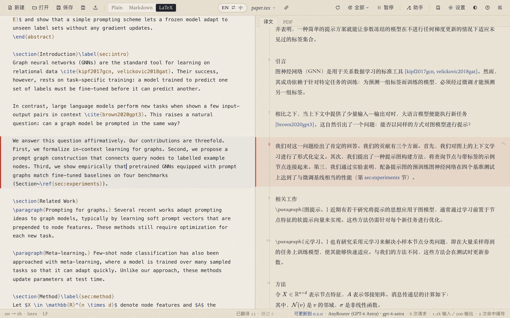
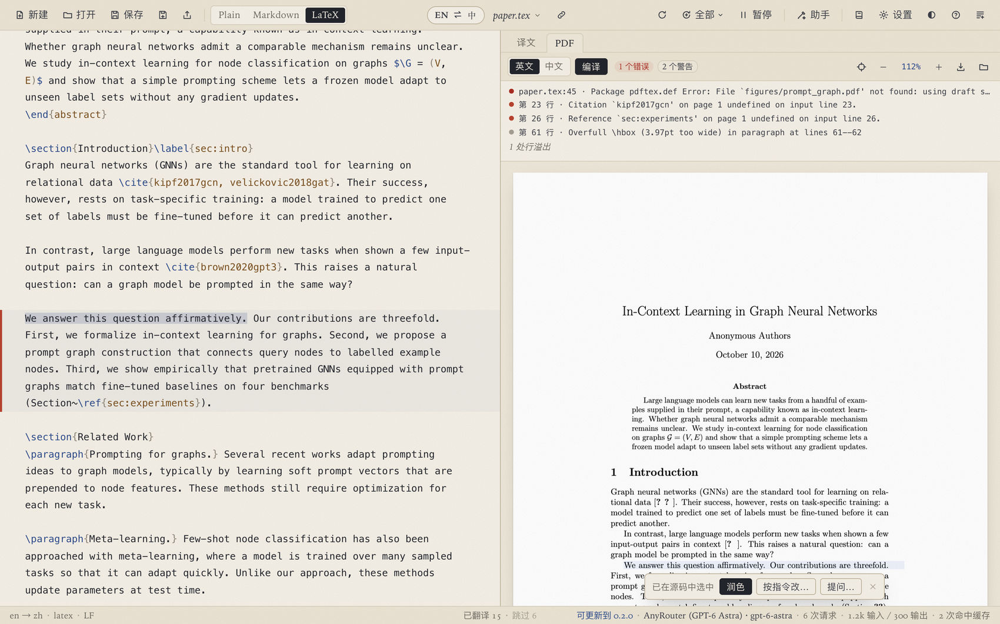
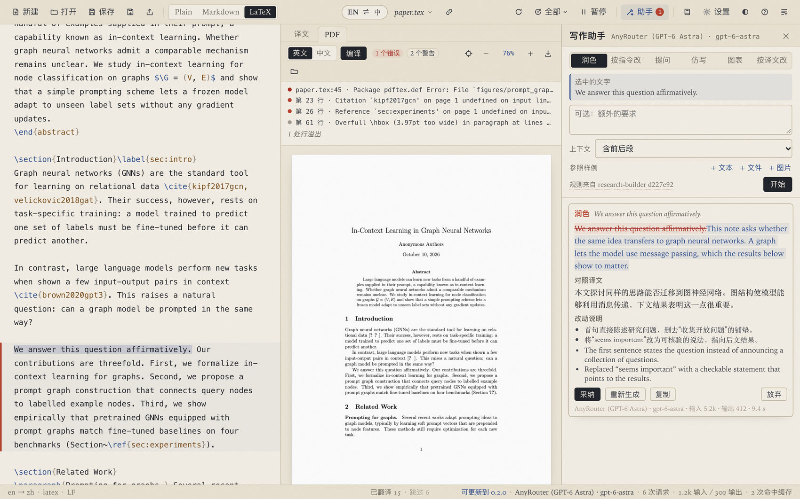
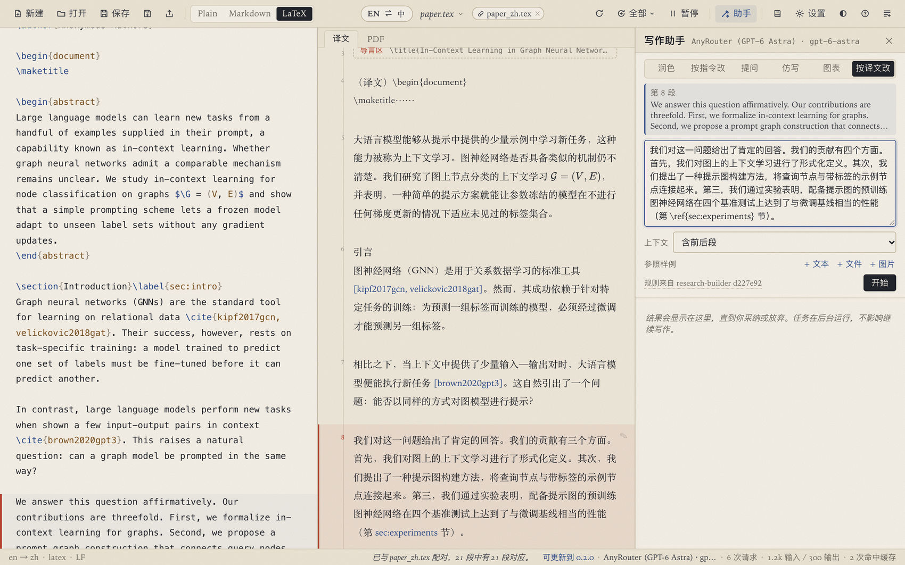

[English](README.md) | **简体中文**

# BiWrite

BiWrite 是一个中英双语的论文写作桌面编辑器。左侧编写正文（LaTeX、Markdown 或纯文本），右侧逐段显示另一种语言，只有改动过的段落会重新翻译。LaTeX 论文在源码旁边编译成 PDF，点击 PDF 中的句子即可在源码中选中该句。写作助手按 [research-builder](https://github.com/qzkinhit/research-builder) 写作技能的规则润色、修改、回答问题、参照已发表的论文仿写新段落和生成图表。界面可选英文或中文。

图文说明书先按一篇论文从模板到投稿的顺序介绍完整写作流程，再逐步介绍每项功能：[使用说明（PDF）](docs/manual/BiWrite-Manual-zh.pdf) · [User guide (PDF)](docs/manual/BiWrite-Manual-en.pdf)。软件工具栏的「说明书」按钮会在 GitHub 上打开它。



## 目录

* [功能一览](#功能一览)
* [安装](#安装)
* [配置模型接口](#配置模型接口)
* [双语编辑](#双语编辑)
* [LaTeX 论文](#latex-论文)
* [已有的中文版](#已有的中文版)
* [写作助手](#写作助手)
* [号池与第三方接口](#号池与第三方接口)
* [请求日志](#请求日志)
* [版本更新](#版本更新)
* [术语表、缓存与日志](#术语表缓存与日志)
* [开发](#开发)

## 功能一览

| 功能 | 说明 |
|---|---|
| [双语编辑](#双语编辑) | 左侧英文，右侧中文（用「EN ⇄ 中」可以反过来）。只有改动过的段落会重新翻译，并以原译文为基础修订。公式、引用、交叉引用、标签、网址和注释以占位符发给模型，返回后逐字节还原。中文文件打开后以中文为原文，未译完就切换时，剩余段落译好后自动填回。 |
| [LaTeX](#latex-论文) | 用本机的 TeX 发行版编译（latexmk、pdfLaTeX、XeLaTeX 或 LuaLaTeX，按项目的 `latexmkrc` 或宏包选择）。PDF 显示在右侧，点击 PDF 在源码中选中句子，`⌘⌥J` 在 PDF 中定位光标，问题列表跳到对应行。也可以由译文编译中文 PDF。 |
| [你自己的中文版](#已有的中文版) | `paper.tex` 与 `paper_zh.tex`，或 `sections_en/` 与 `sections_zh/`，逐段配对。你的中文直接作为译文，不产生请求，保存时把每个改动过的段落原位写入另一个文件。 |
| [写作助手](#写作助手) | 润色、按指令修改、提问、参照已有论文仿写新段落（直接添加其 `.tex`）、生成图表（缺少的宏包一并补上），或改写某段译文让原文随之修改。任务在后台运行，由你决定是否采纳。 |
| [模板](#模板) | 内置 VLDB（PVLDB 2027）、ICLR 2027 和 IEEE TII。可以把项目文件夹或 `.zip` 导入为模板，把项目导出为模板，打开任意 LaTeX 文件夹。 |
| [模型接口](#配置模型接口) | OpenAI 兼容的 Chat Completions（OpenAI、DeepSeek、通义千问、Kimi、OpenRouter、Ollama 等本地服务）、OpenAI Responses 接口和 Anthropic Messages 接口，附带预设，其中包括 AnyRouter 这类第三方服务。翻译和写作助手可以用不同的接口。 |
| [号池](#号池与第三方接口) | 每个接口可以挂多个命名的密钥，按每个密钥的并发上限均匀使用，限流时换号，可以导入和导出到文件。 |
| [请求日志](#请求日志) | 记录每次请求发出的模型、推理强度和服务等级，以及服务端声明的实际值，还有耗时、token 和所用密钥。 |
| [版本更新](#版本更新) | 软件内可以安装 GitHub 上发布的任意版本，包括预发布的分支构建和旧版本。 |
| [窗口](#安装) | 关闭窗口后 BiWrite 带着打开的文档留在菜单栏或任务栏通知区域，可以在设置中关闭这一行为。 |

## 安装

从 [Releases](https://github.com/zzccppp/biwrite/releases) 页面下载安装包：`BiWrite_<版本>_x64-setup.exe`（Windows 10/11）或 `BiWrite_<版本>_universal.dmg`（macOS 12 或更高，支持 Apple 芯片和 Intel）。安装包还没有受信任的证书签名，第一次打开需要你确认：

* **macOS**：先打开一次 BiWrite，关闭警告。然后打开「系统设置」→「隐私与安全性」，在页面下方的「安全性」一栏，macOS 会提示 BiWrite 已被阻止。点「仍要打开」，确认并输入密码。也可以在终端执行 `xattr -dr com.apple.quarantine /Applications/BiWrite.app`，效果相同。
* **Windows**：SmartScreen 提示「Windows 已保护你的电脑」时，点「更多信息」，再点「仍要运行」。

关闭窗口后，BiWrite 继续在菜单栏（macOS）或任务栏通知区域（Windows）运行，点图标可以重新显示窗口或退出。在「设置」的「窗口」一节可以关闭这一行为。

LaTeX 功能需要 TeX 发行版：macOS 用 MacTeX，Windows 和 Linux 用 TeX Live 或 MiKTeX。BiWrite 会在常见位置自动查找，装在别处时可以在「设置」的「LaTeX」一节指定文件夹。

## 配置模型接口

1. 打开**设置**（`⌘,`），选择「+ 添加接口…」，再选一个预设。
2. 核对 Base URL 和模型。保存密钥后，「列出模型」可以获取可用模型。
3. 粘贴一个或多个密钥（每行一个，或者一行名称、下一行密钥），点「添加接口」。密钥保存在系统钥匙串中，之后不再显示。
4. 「测试」翻译一句话。单选按钮选中的接口负责翻译。「写作助手」一节选择润色和提问所用的接口，可以让快速模型负责翻译，更强的模型负责写作。
5. 「请求节奏」中，「每次请求的段落数」（1 到 8）把多个新段落合并成一次请求，「并行请求数」可以跟随号池（密钥数 × 每个密钥的并发）或手动设置。
6. 「界面语言」在英文和中文之间切换界面。

## 双语编辑

* 用**打开**（`⌘O`）选择 `.tex`、`.md` 或 `.txt` 文件。右侧每个方块对应源文的一个段落、标题或图注，点击方块，光标跳到对应段落，该段在两侧同时高亮。
* 停止输入 0.8 秒后，改动过的段落会重新翻译，以原译文为基础修订，并以流式方式显示。公式、引用、交叉引用、标签、网址和注释以占位符发给模型，返回后按原样还原。
* 「EN ⇄ 中」把中文放到左侧编辑，右侧显示英文。只有你改过的中文段落会生成新的英文，切回英文时其余段落逐字还原。切换会等待正在翻译的段落，再点一次立即切换。这些段落先保留原文，译好后自动替换到左侧。
* **全部**菜单提供「重新翻译所有段落」「继续翻译剩余段落」（翻译失败的段落、暂停时积压的段落，以及提前切换后仍是原文语言的段落）和「把原文当作中文」（或英文）。
* 中文文件打开后以中文为原文，翻译成英文，PDF 和导出的 `.tex` 都按文件本身的语言处理。中英混合的文档判断错了，可以在**全部**菜单中改正，左侧文字明显是另一种语言时，点「EN ⇄ 中」也会直接改正。
* **保存**（`⌘S`）把文件本身的语言写回文件，编辑另一种语言时由译文组成。**另存为**（`⌘⇧S`）默认建议一个不重名的文件名，例如 `paper-2.tex`，原文件保持不变。

## LaTeX 论文



* 用**打开**选 `.tex` 文件，或者**新建**后选「打开 LaTeX 文件夹…」按主文件打开项目。多文件项目在标题栏列出文件，主文件通过 `\input` 和 `\include` 链、`% !TEX root = …` 注释，以及并列的 `sections_en/` 与 `sections_zh/` 文件夹确定。
* **PDF** 页签用 `⌘B` 编译，每次保存后也会编译（设置中的「保存 .tex 文件后自动编译」）。错误和警告显示在 PDF 上方，点击跳到对应行。文档有错误时也会生成 PDF。
* **点击 PDF 中的句子**：该句的源码被选中，位于其他文件时 BiWrite 会打开那个文件。旁边的小菜单提供「润色」「按指令改…」和「提问…」。
* `⌘⌥J`（Ctrl+Alt+J）在 PDF 中高亮光标所在段落。
* **英文和中文 PDF**：「中文」开关用 XeLaTeX 和 `ctex` 由译文编译中文 PDF（尚未翻译的段落保持英文）。「另存 PDF…」和「导出中文 .tex…」保存副本。

### 模板

**新建**列出内置模板（官方 PVLDB 和 ICLR 2027 文件、附简短骨架的 IEEE TII 类文件）和你自己的模板。「用此模板新建…」把模板复制到你命名的文件夹并打开。「导入文件夹…」和「导入 .zip…」添加自己的模板，「导出当前项目…」把当前项目连同模板描述打包成 zip。

## 已有的中文版

如果你手动维护一份中文版，BiWrite 可以直接使用它，不再翻译：

* 打开 `paper.tex` 时，如果段落能对上，会自动与 `paper_zh.tex`（也支持 `.zh`、`-zh`、`_cn`）配对，`sections_en/x.tex` 会与 `sections_zh/x.tex` 配对。标题栏的「导入译文」可以与你选择的任意文件配对。
* 段落按类型、共同的引用键与交叉引用键、标签、公式、数字和专有名词，以及长度配对，图在中文文件中位置不同也能找到对应。标题栏显示对上的段落数。
* 你的中文直接作为译文，不产生请求。改一段英文，只有这一段的中文会重新修订。保存时写入两个文件，每个改动过的段落原位替换，中文文件的其余部分逐字节不变。
* 「EN ⇄ 中」切换为编辑中文文件，英文以同样方式跟随。
* 「另存为」把两个文件都按新名字另存（`paper-2.tex` 和 `paper_zh-2.tex`），原文件保持不变。

## 写作助手



用**助手**（`⌘J`）打开。它作用于选中的文字，没有选中时作用于光标所在段落：

* **润色**（`⌘⇧P` 润色光标所在段落）按写作规则修改，去除 AI 腔和拼接句子的破折号、分号，保持论断、数字、引用和公式不变。
* **按指令改**按你的要求修改，**提问**就所选文字或整篇论文回答问题（可以追问）。
* **仿写**按你的要求在光标所在段落之后写新段落。在「参照样例」中用「+ 文件」添加一篇已发表的论文（`.tex` 文件只取正文，去掉注释），新段落模仿它的写法，不照搬它的句子、结论、数字和引用。新段落附带对照中文。
* **图表**生成插入到段落之后的图或表。软件把文档已加载的宏包告诉模型，代码还需要的宏包在插入时补进导言区。
* **按译文改**在输入框中预填这一段的中文。改写中文后运行，英文以最小改动修订为相同的意思。每个已翻译段落上的铅笔按钮可以直接进入这个操作。
* 「上下文」可选只发送目标段落、含前后段或整篇论文。「参照样例」可以添加文字、文件（`.tex`、`.md`、`.txt`）或图片（例如想参照其风格的图）。

每个任务都在后台运行。结果以差异显示改动，附修订稿的中文和中英文两份改动说明。「采纳」把修订写入文字当前所在的位置，即使你在等待期间继续输入。如果目标文字本身在等待期间被改过，「让模型重新套用」会把修订套用到当前文本上。

规则来自开源（MIT）科研写作技能 [research-builder](https://github.com/qzkinhit/research-builder)。BiWrite 自带一份，可以在设置中从 GitHub 更新，也可以换成你自己的技能文件夹。



## 号池与第三方接口

BiWrite 支持 OpenAI 兼容的 Chat Completions 接口、OpenAI Responses 接口和 Anthropic Messages 接口。第三方服务的配置方式与其他接口相同。以 AnyRouter 为例，它的预设填好 Responses 接口地址 `https://anyrouter.top/v1`、模型 `gpt-6-astra`、推理强度「高」、服务等级 Priority、每个密钥并发 2、失败重试 10 次。

「管理号池…」显示号池：

* 给每个密钥起名字。请求交给最空闲的可用密钥，所以各个密钥被均匀使用。
* 被限流的密钥进入冷却，请求转到其他密钥。被拒绝的密钥暂停使用。
* 「每个密钥的并发」限制单个密钥的并发数（AnyRouter 允许 2），「并行请求数」可以跟随号池。
* 「导出到文件…」把名称和密钥保存为文本文件，便于迁移或分享，「从文件导入…」读回这种文件。密钥从钥匙串直接写入文件，不经过界面。文件中是明文密钥，只分享给你信任的人。

## 请求日志

**日志**（`⌘⇧L`）列出每次请求发出的模型、推理强度和服务等级，以及服务端声明的实际值（不一致时标出），还有 HTTP 状态、首字延迟、总耗时、token（含缓存和推理 token）、所用密钥（只显示名称和末尾几位）以及重试和换号的说明。日志可以暂停、清空和保存到文件，不记录正文和密钥。

## 版本更新

「设置」中的「版本更新」列出 GitHub 上的全部发布版本及更新说明。选择任意版本（包括由分支构建的预发布版本）后点「安装」。安装包下载后按 GitHub 提供的 SHA-256 校验。macOS 上原地替换应用，点「立即重启」进入新版本。Windows 上安装程序在 BiWrite 退出后运行。BiWrite 启动时会检查新版本并在状态栏提示（可以关闭）。

## 术语表、缓存与日志

**术语表**保存你对术语的中文译法，或用「保留英文」让术语保持英文。可以导入两列 `term,translation` 的 CSV（UTF-8，Excel 中选「CSV UTF-8」，译法为空或写 `KEEP` 表示保留英文）。只有提到改动过的术语的段落会重新翻译。

翻译缓存位于 `~/Library/Application Support/app.biwrite.desktop/cache.sqlite3`，「设置」中的「翻译缓存」一节显示其内容并可清空。日志写在 `~/Library/Logs/app.biwrite.desktop/`（Windows 为 `%LOCALAPPDATA%\app.biwrite.desktop\logs\`），每天最多 5 MB，保留 7 天。

## 开发

需要 Rust 1.85 或更高版本、Node 20 或更高版本、npm，macOS 上还需要 Xcode 命令行工具。

```sh
npm install
npm run app                     # tauri dev，启动 Vite 开发服务器和应用窗口
npm run dev:mock                # 在浏览器中用模拟后端运行界面
npx tauri build --debug --no-bundle
./target/debug/biwrite samples/paper.tex
```

`dev/mock.html?latex` 打开示例论文及其 PDF（需先把 `samples/paper.tex` 编译为 `dev/sample.pdf`）。

检查：

```sh
cargo test --workspace
cargo clippy --workspace --all-targets -- -D warnings
npm run check                   # svelte-check，有警告即失败
npm test                        # 前端单元测试
cargo test -p biwrite-latex --test tex -- --ignored   # 用本机 TeX 编译测试
cargo test -p biwrite --lib -- --ignored workflow      # 用每个模板走完全部写作步骤，需要本机 TeX
```

代码分为不依赖 Tauri 的几个 crate（`biwrite-core` 负责分段、占位符、配对和助手提示词，`biwrite-engine` 负责翻译队列和缓存，`biwrite-providers` 负责模型接口和号池，`biwrite-latex` 负责编译、SyncTeX 和模板），以及 `src-tauri/` 中的应用和 `src/` 中的 Svelte 前端。详见 [ARCHITECTURE.md](ARCHITECTURE.md)。

### 发布

`.github/workflows/build-installers.yml` 在每次推送 `master` 时构建两个安装包（作为工作流产物）。发布新版本时，同步修改 `src-tauri/tauri.conf.json`、`package.json` 和根目录 `Cargo.toml` 中的版本号，提交后推送对应的标签：

```sh
git tag -a v0.2.0 -m "BiWrite 0.2.0"
git push origin v0.2.0
```

工作流会检查标签与版本号一致，构建两个安装包并创建附带安装包的 GitHub Release。带后缀的标签（`v0.2.1-beta.1`）发布为预发布版本，软件的「版本更新」中同样会列出。
